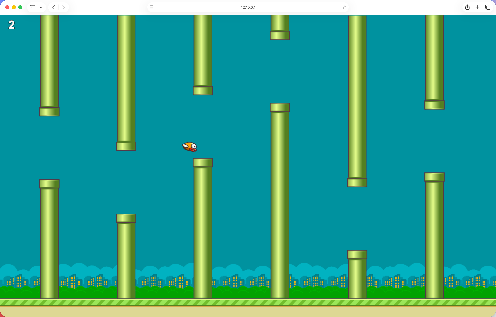

## 像素鸟小游戏

一个基于 Canvas 和原生 JavaScript 实现的像素鸟游戏。

### 功能特点

- 🎮 支持键盘、鼠标和触摸屏操作
- 📱 响应式设计，适配 PC 端和移动端
- 🌓 昼夜场景切换
- 📊 实时计分系统
- 🚀 难度随分数递增
- 🎯 移动端优化（重力、跳跃力度、水管间隙）

### 操作说明

**PC 端：**
- 空格键 / a-z / 0-9：控制小鸟跳跃
- 回车键：游戏结束后重新开始（需等待3秒冷却）

**移动端：**
- 点击屏幕：控制小鸟跳跃
- 游戏结束后点击重新开始（需等待3秒冷却）

### 游戏机制

- 小鸟默认受重力影响下坠
- 点击/按键可让小鸟向上飞
- 避开上下水管，每通过一个水管得 1 分
- 每 3 分水管间隙减少 25 像素
- 每 5 分移动速度增加 0.2 px/帧
- 碰到水管、地面或屏幕顶部游戏结束
